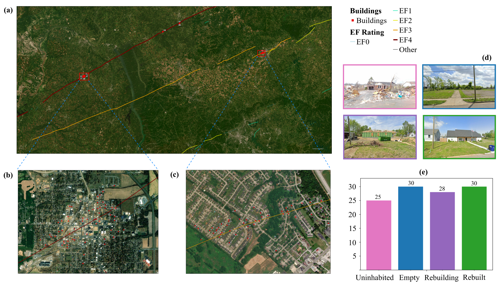
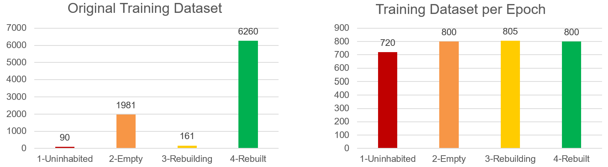
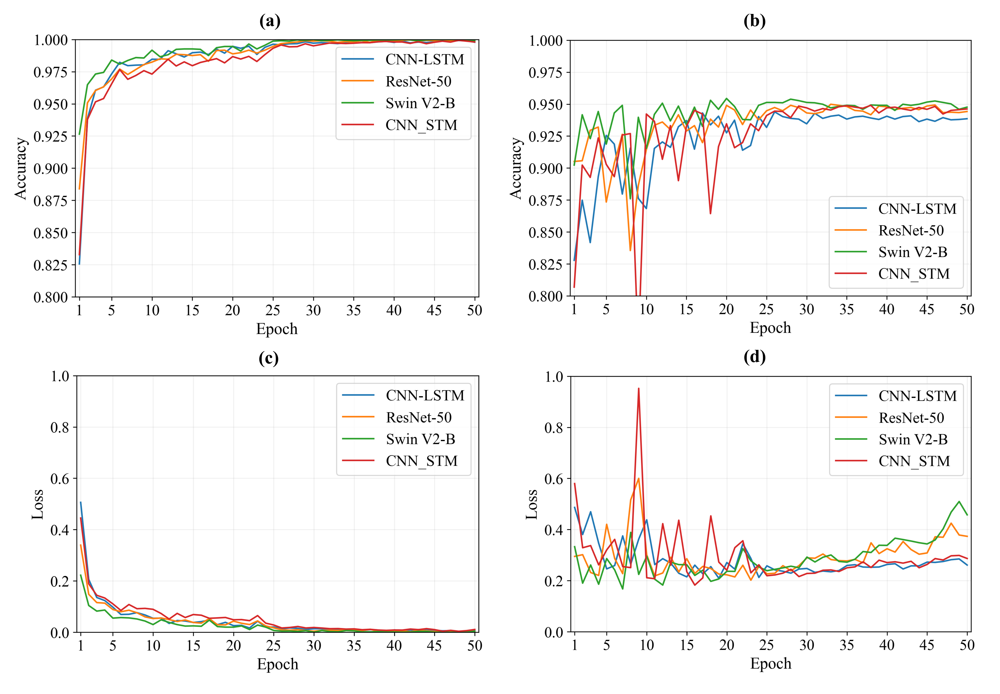
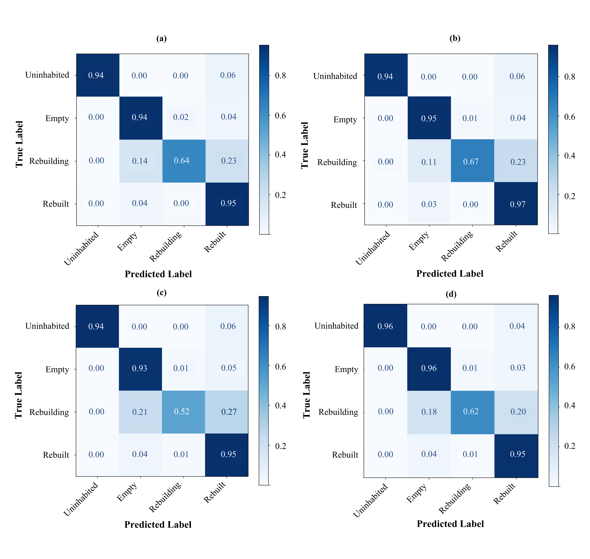
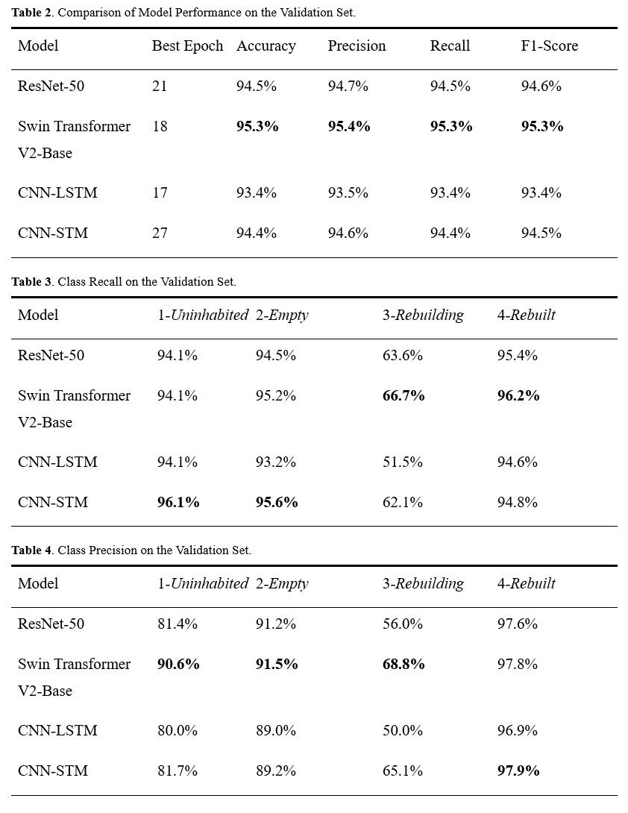
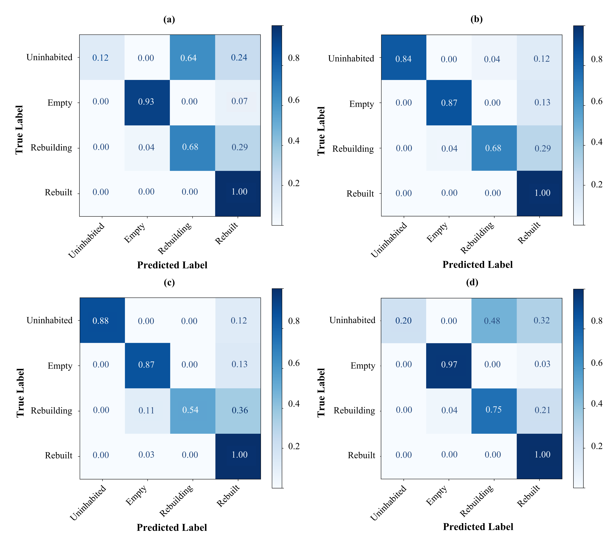
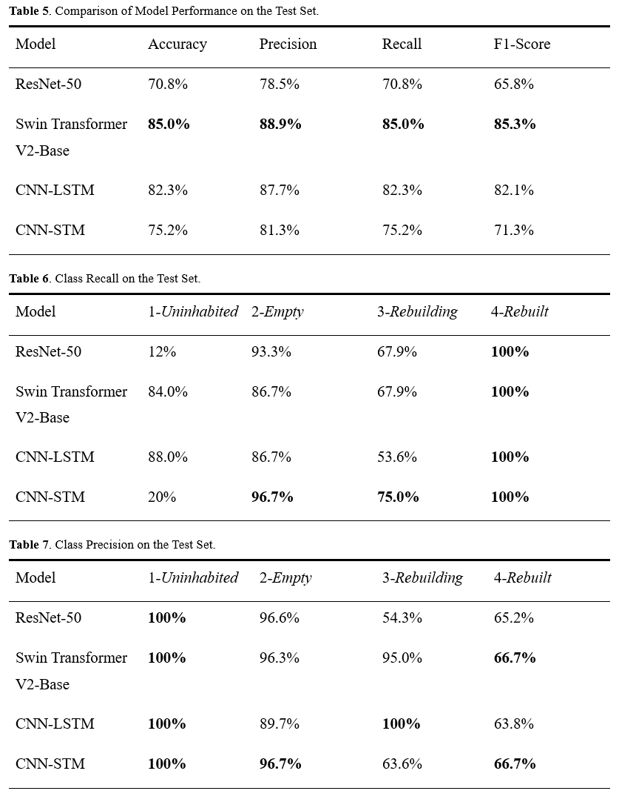

# Deep Learning: Dataset, Training, and Performance

## Training and Validation Sets
Spatial videos were collected in Joplin from 2011 to 2016, on a yearly basis, following the 2011 Joplin tornado. About 3,000 out of 7,912 buildings that were within the tornado path are considered, covering a span of six intervals. The training and validation sets are split geographically and are carefully curated to avoid spatial overlap and prevent geographic data leakage.

**Table 1**. Training and Validation Sets Distribution.
| Class | Train | Validation | Ratio (Train:Validation)
|:---|:---|:---|:---|
| *1-Uninhabited* | 90 | 51 | 6:4 |
| *2-Empty* | 1981 | 993 | 7:3 |
| *3-Rebuilding* | 161 | 66 | 7:3 |
| *4-Rebuilt* | 6260 | 2422 | 7:3 |

## Test Set
About 30 samples for each recovery state were collected from Google Earth Pro, Google Maps, and damage reconnaissance by the [RAPID Facility](https://www.mapillary.com/app/user/uwrapid?focus=photo&pKey=5057284717635195&x=0.5445942809184025&y=0.5694465379732327), in Mayfield, Bowling Green, Dawson Springs, and Barnsley, Kentucky. This data was used to test the model's performance and generalizability.

**Figure 1**. Satellite View of: (a) Mayfield, Kentucky Tornado Path, (b) Mayfield, Kentucky, and (c) Bowling Green, Kentucky; (d) Samples and (e) Distribution of the Test Set.

## Data Augmentation
To balance the training dataset, an augmentation factor of 8 was used for the *Uninhabited* class and 5 for the *Rebuilding* class. For the majority class (i.e., *Empty* and *Rebuilt* classes), instead of using a fixed number of training samples, a fresh batch of 800 *Rebuilt* and 800 *Empty* samples was created and trained on at every epoch. With this, the class imbalance issue is mitigated while ensuring the models are exposed to diverse training samples

**Figure 2**. Data Augmentation of the Training Dataset

## Training
The deep learning framework is PyTorch. All four models were trained on an Intel Xeon 8352Y 2.20 GHz 64-core Central Processing Unit (CPU), 256GB  RAM, and one 40GB A100 Graphics Processing Unit (GPU). 

Both the training and validation losses were monitored and recorded to observe underfitting and overfitting after each epoch. At the end of the training session, the model will be restored to the epoch at which the five-point moving average of the validation loss is minimum.

## Performance on the Validation Set

**Figure 3**. Loss and Accuracy Curves of Four Models: (a) Training Accuracy, (b) Validation Accuracy, (c) Training Loss, (d) Validation Loss.

**Figure 4**. Confusion Matrices on the Validation Set of: (a) ResNet-50, (b) Swin Transformer V2-Base, (c) Convolutional Neural Network-Long Short-Term Memory, and (d) Convolutional Neural Network-Sequential Transformer Module.

## Performance on the Test Set

**Figure 5**. Confusion Matrices on the Test Set of: (a) ResNet-50, (b) Swin Transformer V2-Base, (c) Convolutional Neural Network-Long Short-Term Memory, and (d) Convolutional Neural Network-Sequential Transformer Module.

## Conclusion
While all four models achieve comparable performance, the results show that the **CNN-LSTM** offers the best overall performance given the trade-off among overall F1-score, computational efficiency, and inference time. On unseen data, the model achieves an overall F1-score of 82.1% and acceptable performance on both the majority and the minority class (e.g., a precision of 63.8% on the *Rebuilt* class and a recall of 53.6% on the *Rebuilding* class). 
