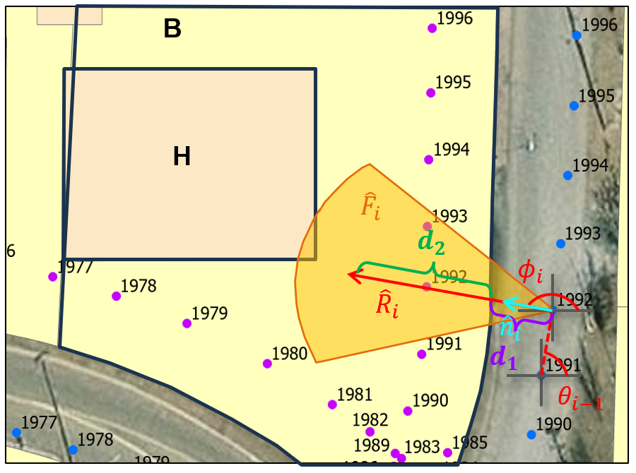
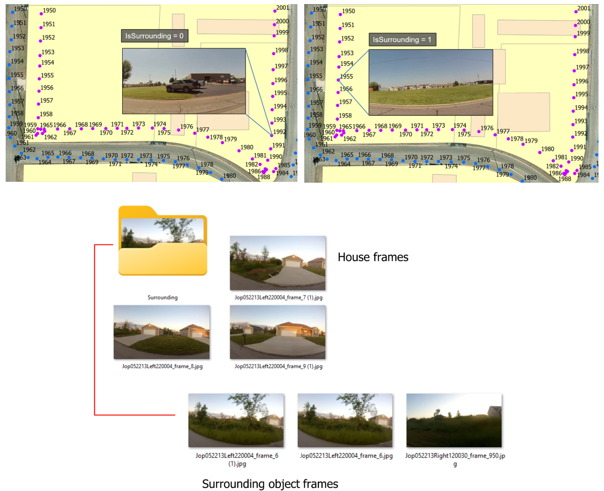

## Frequently Asked Questions

[Why do we need to use GIS Offset or Frame Offset?](#why-do-we-need-to-use-gis-offset-or-frame-offset)

[How is the data transformed?](#how-is-the-data-transformed)

[Why do we need the Surrounding folder?](#why-do-we-need-the-surrounding-folder)

### Why do we need to use GIS Offset or Frame Offset?

We recognize that there are some misalignment between the GIS and the spatial video files. To correct this issue, we created the GIS Offset and Frame Offset options in the toolbox. For example, inputting a value of 1 in the GIS Offset box will move the GIS one point forward. On the other hand, inputting a value of 1 in the Frame Offset box will move the spatial video one frame forward. 

### How is the data transformed?
[**Table 1**](#table-1-dynamic-gis-transformation-algorithm) summarizes the algorithm that transforms the GIS and dynamically calculates the parcel’s depth to ensure a consistent transformation. All the symbols and definitions are listed in [**Table 2**](#table-2-symbols-and-their-definitions-in-the-dynamic-gis-transformation-algorithm). The core principle is to group all the GIS into their respective parcel, so data can be labeled on a parcel-level, or in other words, in terms of address folders.

The transformation algorithm begins with calculating the bearing of each GIS data point based on **Equation 1**. Then, the offset angle will be applied to the bearing based on the camera direction to form the transformation bearing $\phi_i$, which will be used to calculate a directional vector $\hat{n}_i$.

In the next step, a $60^\circ$ fan with a radius of 150 ft is generated to search for the house polygons. These values are chosen based on experiments to determine whether the house is too far away in the frames, which renders the assessment ineffective from a human perspective.

Afterwards, a vector $\hat{R}_i$ with a length of 100 ft is generated from the GIS point to search for the parcel boundary. Lastly, the GIS will be projected into the parcel, with a depth of 30 ft or one-half of the parcel’s depth.

Similarly, the vector length and the dynamic projecting distance are chosen with these values based on experiments. The dynamic logic ensures that the transformed GIS will always be within the parcel’s boundary. **Figure 1** illustrates a GIS data transformation using the dynamic transformation algorithm.

**Figure 1**: Dynamic GIS Transformation Example

θᵢ = atan2(sin(Δlong) · cos(lat₂),
cos(lat₁)sin(lat₂) − sin(lat₁)cos(lat₂)cos(Δlong))   (Equation 1)

Where:

- $\Delta long = long_2 - long_1$
- $long_1, long_2$: longitude coordinates of GIS points 1 and 2, respectively
- $lat_1, lat_2$: latitude coordinates of GIS points 1 and 2, respectively

#### Table 1. Dynamic GIS Transformation Algorithm

Inputs:

- $c$ = Camera direction  
- $S_i = (x_i, y_i)$ = GIS point  
- $H$ = House polygons  
- $B$ = Parcel boundaries  
- $r = 150\ ft$

Procedure:

1. For each GIS point $S_i$:

2. Calculate bearing $\theta_i$ based on Equation 1

3. Determine camera offset:

   - If $c = \text{Left} \rightarrow \delta = +90^\circ$
   - Else if $c = \text{Right} \rightarrow \delta = -90^\circ$

4. Calculate the directional vector $\hat{n}_i$ towards the parcel:

   $$\phi = \theta_i + \delta $$

   $$\hat{n}_i = [\sin(\phi), \cos(\phi)]^T$$

5. Generate a $60^\circ$ fan to search for $H$:

   $\hat{F}_i = \{S_i + r \cdot \hat{n}_i : \phi \in [\phi - 30^\circ,\ \phi + 30^\circ]\}$
    
   - If $(\hat{F}_i \cap H) \neq \emptyset \rightarrow \text{IsSurrounding} = 1$
   - Else $(\hat{F}_i \cap H) = \emptyset \rightarrow \text{IsSurrounding} = 0$

7. Generate a vector $\hat{R}_i$ from the GIS point to search for $B$:

   $$\hat{R}_i(s) = S_i + s \cdot \hat{n}_i,\quad s \in [0,100\ ft]$$

   - If $\hat{R}_i \in B \rightarrow d_1 = \min\{s \in [0,100\ ft]\}$
   - Else $\hat{R}_i \notin B \rightarrow d_1 = 0$

8. Transform the GIS:

   $$P_1 = \hat{R}_i \cap B$$

   $$P_2 = \text{endpoint of } \hat{R}_i$$

   $$d_{in} = \text{distance between } P_1 \text{ and } P_2$$

   - If $\hat{R}_i \in B$:
     - If $d_{in} > 30\ ft \rightarrow d_2 = 30\ ft$
     - Else $d_{in} \leq 30\ ft \rightarrow d_2 = \dfrac{d_{in}}{2}$

   - Else $\hat{R}_i \notin B \rightarrow d_2 = 0$

9. Final transformed GIS point:

   $$T_i = S_i + (d_1 + d_2)\cdot \hat{n}_i$$

#### Table 2. Symbols and Their Definitions in the Dynamic GIS Transformation Algorithm
| Symbol | Definition |
|:---|:---|
| $B$ | Parcel boundary |
| $c$ | Camera direction |
| $d_1$ | Distance from the GIS to the intersection of the parcel edge and vector $\hat{R}$ | 
| $d_2$ | Dynamic projecting distance from $P_1$ accounting for a parcel's depth |
| $d_{in}$ | Distance between $P_1$  and $P_2$ |
| $\hat{F}$ | Fan that searches for the house polygon |
| $H$ | House polygon |
| $\hat{n}$ | Directional vector towards a parcel $\hat{R}$ |
| $P_1$ | Point of intersection between the parcel edge and vector $\hat{R}$ |
| $P_2$ | Endpoint of the vector $\hat{R}$ |
| $r$ |	Radius of the fan $\hat{F}$ |
| $\hat{R}$ | ̂Vector that searches for the parcel boundaries |
| $s$ | Distance from the GIS to the endpoint of vector $\hat{R}$ to ensure visibility of the house in the frame |
| $S$ | 	GIS point |
| $T$ |	Transformed GIS point |
| $δ$ |	Offset angle |
| $θ$ |	Bearing of a GIS point |
| $ϕ$ | Transformation bearing of the GIS point after being offset |

### Why do we need the Surrounding folder?

A frame from the spatial video might or might not contain views of the house, which are the main object in assessing recovery. Having surrounding object, such as trees, fences, or yards, in the address folder creates noise and interfere with the deep learning’s assessment. As a result, IsSurrounding tag is created to separate house frames from surrounding object frames, keeping address folders with clean data. 

**Figure 2**: A Surrounding Folder

