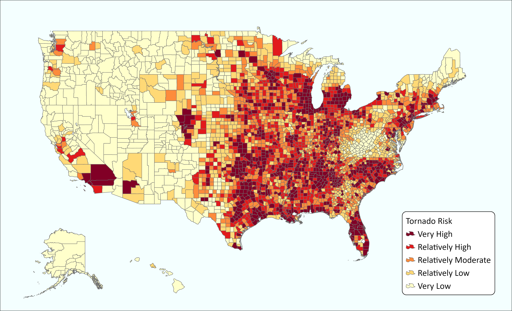

# Automated Temporal Tracking of Post-Tornado Housing Recovery Using Street-View Imagery, Deep Learning, and GIS

## Introduction
* Each year, the U.S. experiences more than 1,200 tornadoes, making it the most tornado-prone country in the world.
* Texas, Florida, and Oklahoma are the leading tornado-prone states.
* Tornadoes damage and destroy houses, resulting in societal and economic losses.
* Economic losses from tornadoes are estimated to be $1.0 billion annually.

