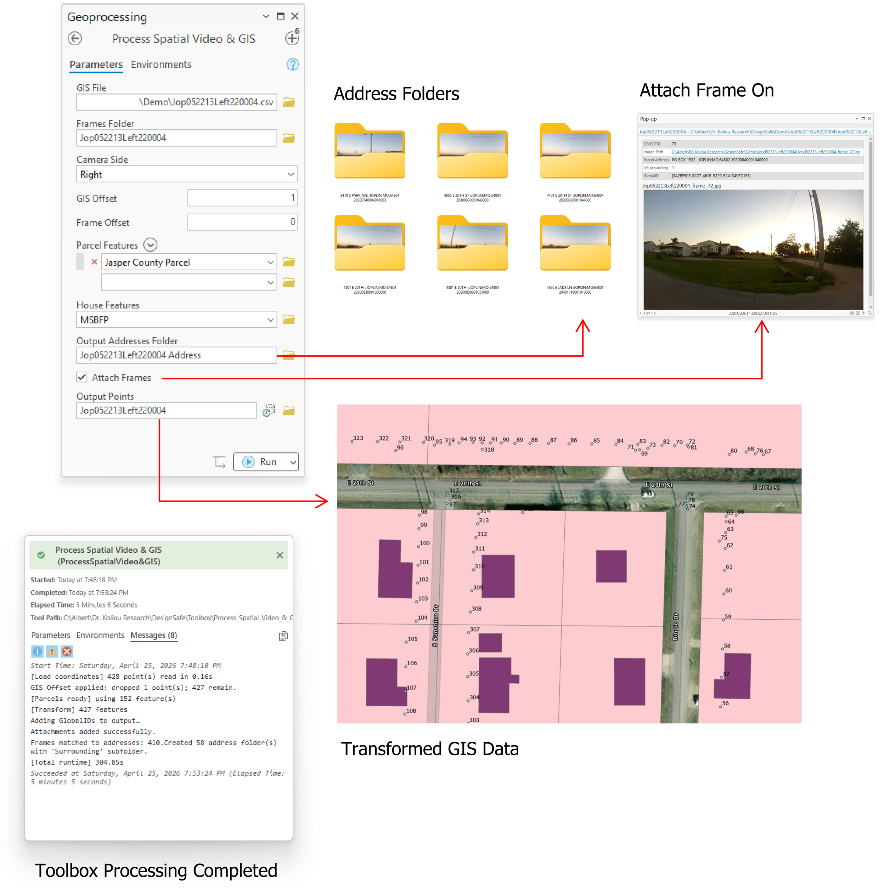
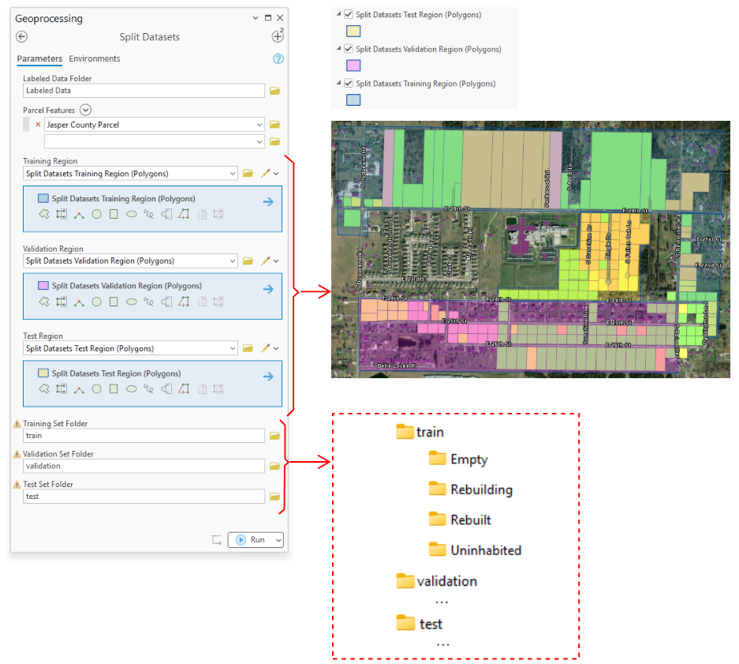
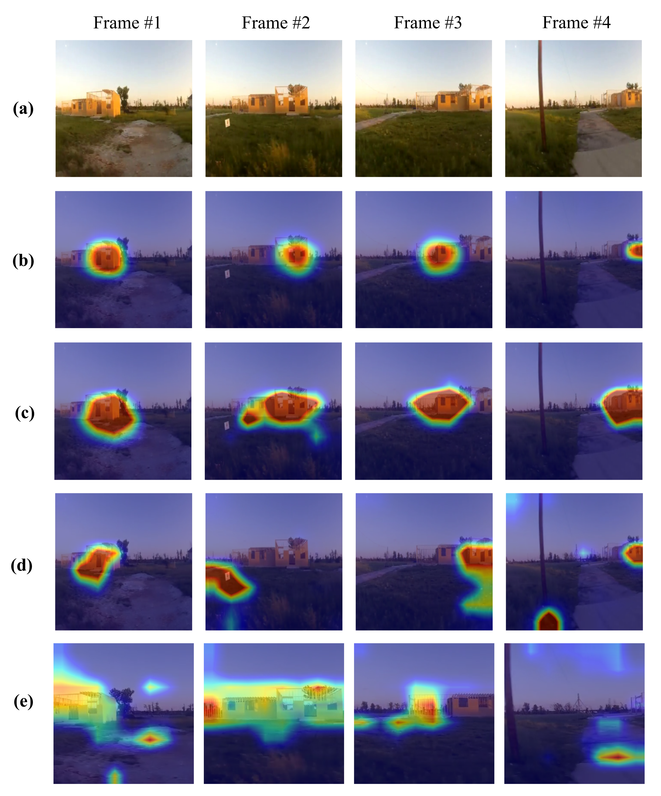
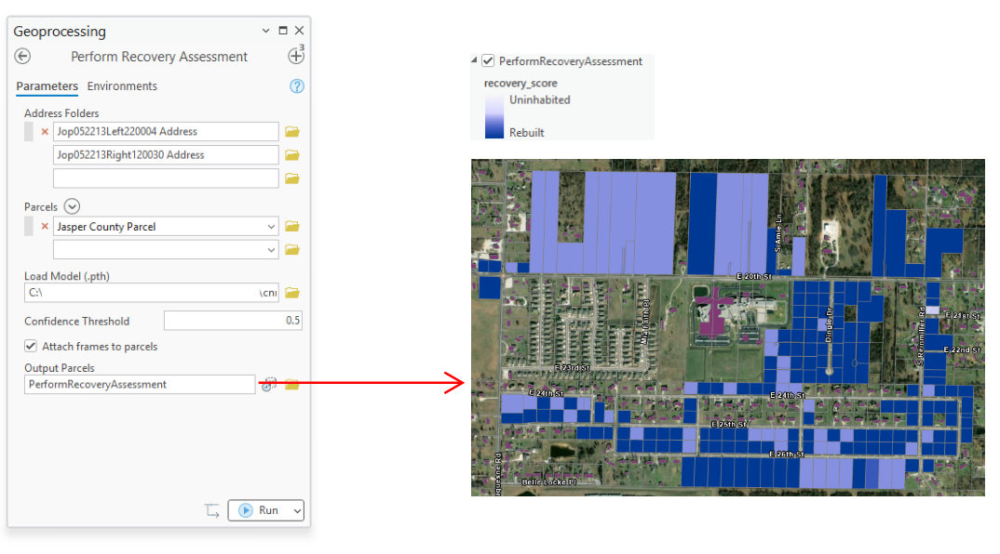
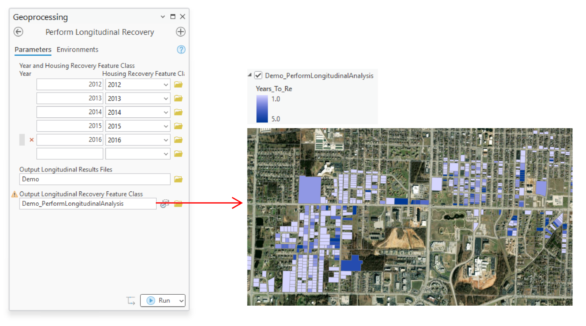
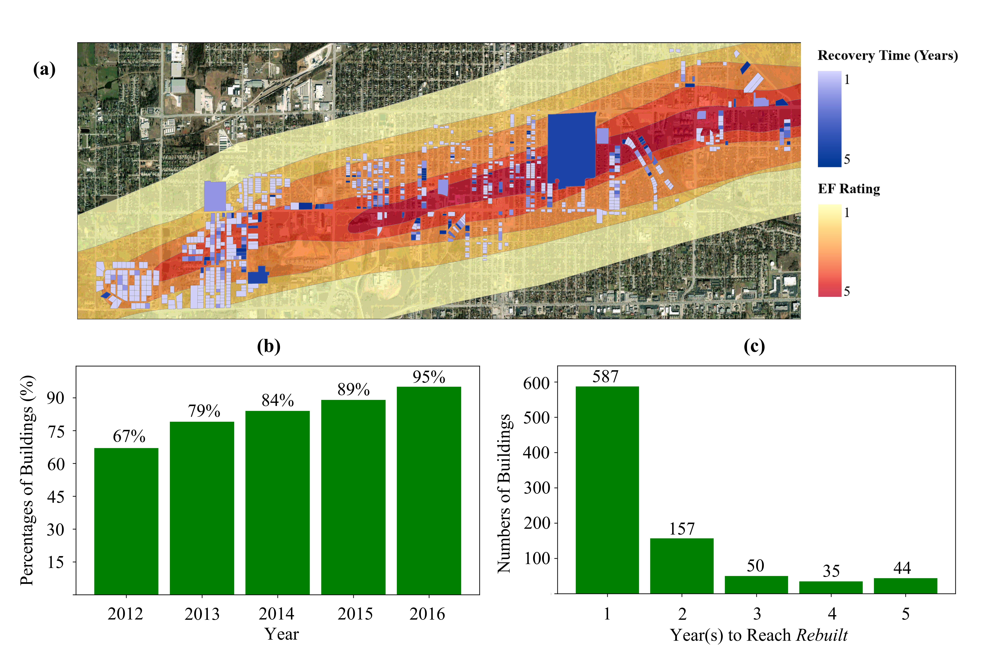

<h1 align="left"> TornadoNET: A Deep Learning Approach for Geospatial Data to Automate Housing Recovery Assessment Using the 2011 Joplin Tornado and 2021 Mayfield Tornado Datasets </h2>

<h4 align="left">by <a href="https://www.linkedin.com/in/q-tran/">Tuan Tran</a>a, <a href="https://www.linkedin.com/in/abdullah-braik-ph-d-0b9189134/">Abdullah Braik</a>b, <a href="https://www.linkedin.com/in/mariakoliou/">Maria Koliou</a>c</h4>

a Graduate Student, Zachry Department of Civil and Environmental Engineering, Texas A&M University, College Station, TX, 77843, U.S.A., E-mail: tuan.tran@tamu.edu

b Postdoctoral Research Associate, Zachry Department of Civil and Environmental Engineering, Texas A&M University, College Station, TX, 77843, U.S.A., E-mail: abraik3@tamu.edu

c Associate Professor and Zachry Career Development Professor II, Zachry Department of Civil and Environmental Engineering, Texas A&M University, College Station, TX, 77843, U.S.A., E-mail: maria.koliou@tamu.edu 

## Overview
TornadoNET is a 7-step end-to-end automation framework that helps community leaders and stakeholders achieve faster and more effective recovery assessment following a tornado. Tracking housing recovery using traditional methods, such as door-to-door surveys, is time-consuming and labor-intensive and delays critical post-disaster decision-making. To this end, street-view imagery, deep learning, and GIS can be used to facilitate recovery assessment. The seven steps of the framework are as follows:

1. Gather Input Data
2. Process Data
3. Label Data
4. Split Training, Validation, and Testing Sets
5. Train Deep Learning Models
6. Classify the Data
7. Analyze Longitudinal Results

**Figure 1**: Automated Recovery Assessment Framework. 

## Requirements
* ArcGIS Pro 3.6
* Jupyter Notebook 7.2.2
* Python 3.9 or higher
* PyTorch 
* Dependencies from `requirements.txt` for running the deep learning models in Jupyter Notebook and `Install Dependencies` for using the ArcGIS Pro toolboxes.

## Step 1: Gather Input Data
* `Spatial videos`: camera synced to a GPS, containings street-view frames and GIS files
* `GIS files`: latitute and longitude coordinates corresponding to a street-view frame 
* `Parcel polygons`: supplied by local tax assessors and available on ArcGIS Online and act as a geometric boundary for the GIS transformation 
* `House polygons`: available via [Microsoft Building Footprints](https://github.com/microsoft/usbuildingfootprints) and used to separate street-view frames containing scenes of the house from those do not. 

Demo data can be found [here](demo)

**Figure 2**: Illustration of a spatial video set-up

## Step 2: Process Data
* Extract frame from spatial videos using the [extract_frame.ipynb](toolbox/extract_frames.ipynb) notebook.
* [Process Spatial Video & GIS Toolbox](toolbox/Process_Spatial_Video_&_GIS.pyt) will be used to:
  * Match the street-view frame with the GIS
  * Ensure the frame and GIS are aligned via GIS and frame offset
  * Group frames into Address Folders (i.e., frames containing views of the house)
 

**Figure 3**: Workflow of Process Spatial Video & GIS Toolbox. 

## Step 3: Label Data
| Recovery States | Elaboration |
|:---|:---|
| *1-Uninhabited* | Debris and collapse, and moderate damage to houses can be seen. |
| *2-Empty* | No sign of reconstruction can be seen. |
| *3-Rebuilding* | Foundation construction, wall enclosures, and housewrap can be seen. |
| *4-Rebuilt* | Good as new. Slight or minor damage to nonstructural components. |

**Figure 4**: Samples of Training Datasets: (a) Uninhabited; (b) Empty; (c) Rebuilding; (d) Rebuilt. 

## Step 4: Split Datasets
Once all the data are labeled, the dataset is geographically split into training, validation, and test sets in ArcGIS Pro using the [Split_Datasets.pyt](toolbox/Split_Datasets.pyt) toolbox.

**Figure 5**: Workflow of the Split Datasets Toolbox. 

## Step 5: Train Deep Learning Models
Four deep learning models are set up, trained, validated, and tested in [deep_learning](deep_learning): 
* [ResNet-50](deep_learning/resnet50.ipynb)
* [Convolutional Neural Network-Long Short-Term Memory](deep_learning/cnn_lstm.ipynb)
* [Convolutional Neural Network-Long Short-Term Memory](deep_learning/cnn_stm.ipynb)
* [Swin Transformer V2-Base](deep_learning/swin.ipynb)

To use the Jupyter Notebooks files, ensure the utilities files are also downloaded. Additionally, the deep learning results can be viewed [here](DEEP_LEARNING_RESULTS.md). 

### Gradient-weighted Class Activation Mapping (Grad-CAM) Analysis
To make the results more explainable, Grad-CAM analysis is employed to understand how deep learning models identify salient features within the images. Grad-CAM analysis generates heatmaps showing important regions that the models use to predict the recovery state. The complete notebooks and utilities files for Grad-CAM analysis can be found under [gradcam](deep_learning/gradcam).

**Figure 6**: Samples of Heatmaps Generated by Grad-CAM Analysis: (a) Original; (b) ResNet-50, (c) CNN-LSTM, (d) CNN-STM, and (e) Swin Transformer V2-Base.

## Step 6: Classify the Data
The trained deep learning models can be used to classify the recovery state of the datasets using the .PTH file. The ArcGIS toolbox can be used to perform large-scale mapping of recovery data.

**Figure 7**: Workflow of the Perform Recovery Assessment Toolbox and Visualization of Results. 

## Step 7: Analyze Longitudinal Results
After obtaining the classification results of the recovery dataset over multiple time periods, a longitudinal analysis can be performed using the [Perform_Longitudinal_Analysis.pyt](toolbox/Perform_Longitudinal_Analysis.pyt) toolbox to understand the recovery pace and pattern.

**Figure 8**: Workflow of the Perform Longitudinal Analysis Toolbox and Satellite View of (a) Longitudinal Analysis of Recovery at Joplin from 2012 to 2016; (b) Percentages of Recovered Buildings from 2012 to 2016, and (c) Distribution of Recovery Time of Buildings. 

## Datasets
Spatial videos at Joplin from 2011 to 2016:

