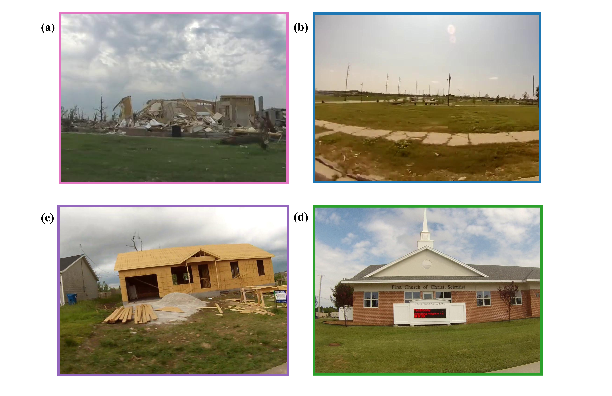

# A User-Friendly Tool to Automate Assessment of Housing Recovery Following a Tornado

## Introduction
* Each year, the U.S. experiences more than 1,200 tornadoes, making it the most tornado-prone country in the world.
* Texas, Florida, and Oklahoma are the leading tornado-prone states.
* Tornadoes damage and destroy houses, resulting in societal and economic losses.
* Economic losses from tornadoes are estimated to be $1.0 billion annually.

**Figure 1**: U.S. Tornado Risk Map Using FEMA Data 

## Motivation
* Current housing recovery methods, such as door-to-door surveys, are time-consuming and labor-intensive.
* Street-view imagery and deep learning have not been used to assess housing recovery over multiple time periods.
* Past studies focused on deep learning algorithms rather than an automation pipeline.
* An automation pipeline with user-facing applications will empower community leaders to track post-tornado housing recovery and make informed recovery decisions.

## Methodology
The automation pipeline for the recovery assessment is presented in Figure 2:
* **Step 1**: The automation begins with collecting data. First, the spatial video data and its corresponding GIS data are recorded; the video will then be extracted into frames at an interval of one second, which matches the pace of the GIS data. Parcel data is available on ArcGIS Online, which is supplied by the local authority. House polygons are available through the Microsoft Building Footprint dataset, which contains building footprint polygons from 50 states in the U.S (Microsoft, 2018).
* **Step 2**: All data are processed by a custom ArcGIS toolbox that matches each frame with its corresponding GIS data and then projects the GIS points to the associated parcel. The output of this ArcGIS toolbox is a set of address folders, each containing a series of frames of the parcel that the spatial video records. Since building architecture across the U.S. or in other countries can vary, this framework allows users to retrain the deep learning model or use the pre-trained model to make inferences.
* **Step 3**: The address folders are sorted, or “labeled”, into different categories representing various housing recovery states.
* **Step 4**: All labeled data are projected back into ArcGIS and split into training and validation datasets for the deep learning model.
* **Step 5**: The deep learning models will be trained on the datasets processed per the previous step.
* **Step 6**: The trained models can be used to classify the data. 
* **Step 7**: A longitudinal analysis of recovery can be performed to understand the pace or pattern of recovery.

**Figure 2**: Automated Recovery Assessment Framework. 

## Step 1: Gather Input Data
* Spatial Videos
* GIS files
* Parcel Polygons
* House Polygons

## Step 2: Process Data
* First, frames will be extracted from spatial videos at a 1-second interval
* Process Spatial Data Toolbox will be used to:
  * Match the frame with the GIS
  * Transform and map the GIS to the corresponding parcels
  * Group frames into Address Folders (i.e., frames containing scene of the house)

## Step 3: Label Data

**Table 1**. Criteria for Labeling Frames for the Classification Model
| Recovery States | Elaboration |
|:---|:---|
| *1-Uninhabited* | Debris and collapse, and moderate damage to houses can be seen. |
| *2-Empty* | Debris has been cleaned up; grass has grown. However, no sign of reconstruction can be seen. |
| *3-Rebuilding* | Lots are being cleared to construct foundations; wall enclosures are up, and housewrap can be seen. |
| *4-Rebuilt* | Good as new. Slight or minor damage to nonstructural components. |

**Figure 3**: Samples of Training Datasets: (a) Uninhabited; (b) Empty; (c) Rebuilding; (d) Rebuilt. 

## Step 4: Split Train/Validation Dataset

## Step 5: Train Deep Learning Models

## Step 6: Classify the Data

## Step 7: Analyze Longitudinal Results

## Installation
1. Clone this repository

2. Install dependencies

3. Run setup from the repository root directory

4. 

## Citation
Use this bibtex to cite this repository

