# User Manual & Tutorial: Using Custom ArcGIS Pro Toolboxes to Automate Recovery Assessment

## Table of Contents

[Install Dependencies](#install-dependencies)

[Import Custom Toolboxes to ArcGIS Pro](#import-custom-toolboxes-to-arcgis-pro)

[Process Spatial Video & GIS](#process-spatial-video-and-gis-toolbox)

[Merge Address Folders](#merge-address-folders-toolbox)

[Map Parcels](#map-parcels-toolbox)

[Split Datasets](#split-datasets-toolbox)

[Perform Recovery Assessment](#perform-recovery-assessment-toolbox)

[Perform Longitudinal Analysis](#perform-longitudinal-analysis-toolbox)	

## Install Dependencies
1. Open ArcGIS Python Command Prompt.

2. Clone the existing environment and activate your cloned environment.

```
conda create --clone arcgispro-py3 --name arcgispro-py3-clone
activate arcgispro-py3-clone
```

3. Upgrade pip tools.

```
python -m pip install --upgrade pip setuptools wheel
```

4. Install dependencies.
```
python -m pip install Pillow
python -m pip install --no-deps torch torchvision torchcam
python -m pip install ^
timm ^
albumentations ^
opencv-python ^
matplotlib ^
pandas ^
scikit-learn ^
tqdm ^
ipython ^
jupyter ^
ipykernel ^
notebook
```

## Import Custom Toolboxes to ArcGIS Pro
1. Open the `Catalog View` by clicking on the `View` tab
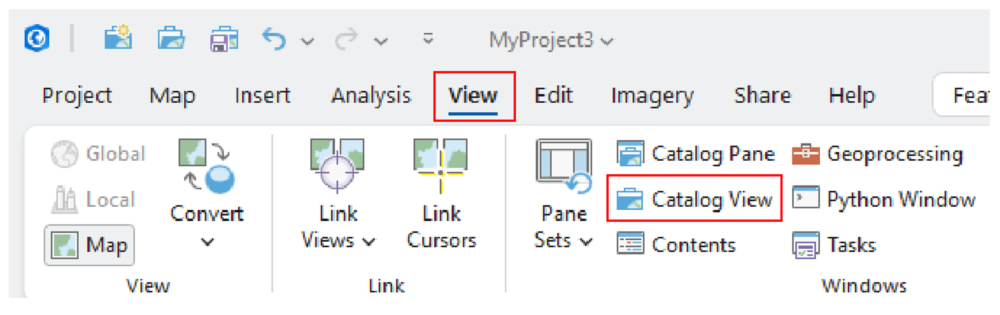

2. Click on `Toolboxes` tab under `Project`, and then right-click within the Catalog window to `Add Toolbox`.
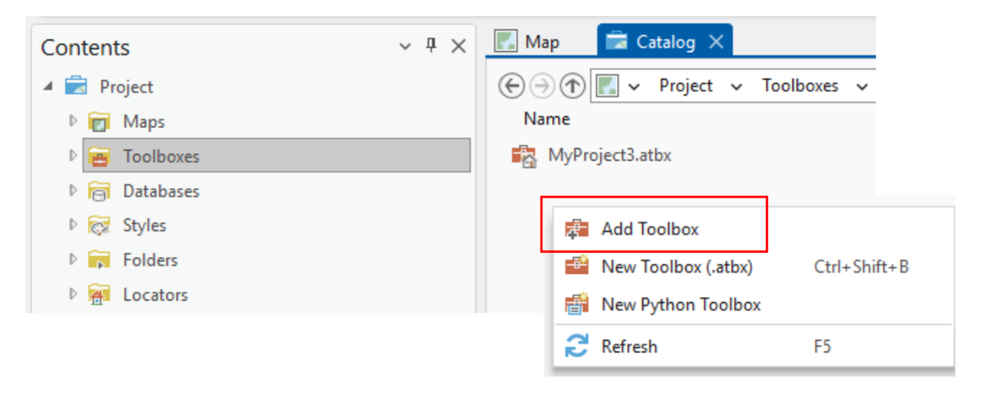

3. Go to the directory that contains the toolboxes. Select all toolboxes and click `OK`.
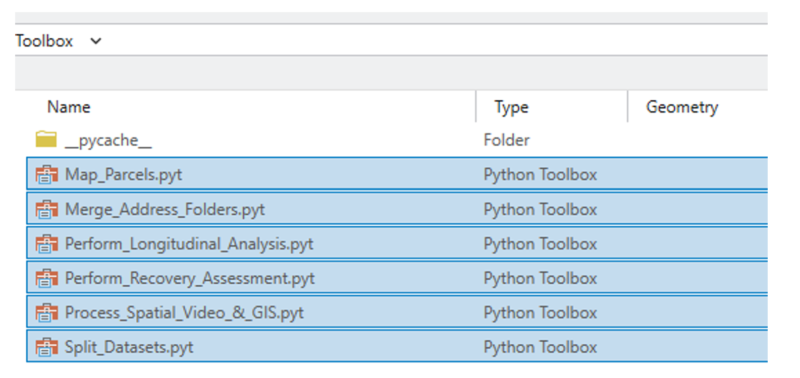


## [Process Spatial Video and GIS Toolbox](toolbox/Process_Spatial_Video_&_GIS.pyt)
### Summary
This toolbox matches the extracted frames from the spatial video with the coordinates in the GIS files. The algorithm will transform the GIS based on the user’s provided camera direction, offset, parcel polygon, and house polygon. The user can also attach a frame to the GIS to view in ArcGIS. The output of this toolbox is the transformed GIS and the Address Folders, each of which contains imagery of the house.  
### Illustration


### Files Requirement

|*File* |*Elaboration* |
|:---|:---|
|[extract_frame.ipynb](toolbox/extract_frames.ipynb) | This notebooks extracts frame from the spatial video|
|[Jop052213Left220004.csv](demo/Jop052213Left220004.csv) | CSV file containing latitude and longitude coordinates|
|[Jop052213Left220004.mp4](demo/Jop052213Left220004.mp4) | Spatial video capturing street-view imagery|
|[Jasper_County_Parcel.shp](demo/geospatial_data) |	Parcel polygon feature used to transform the GIS data|
|[MSBFP.shp](demo/geospatial_data) |House polygon feature used to separate images containing views of house from those containings view of surrounding objects|

### Tutorial
1.	Use the `extract_frame.ipynb` to extract the spatial video into frames at an interval of 1 second. Change the name of the video directory `path_in` and the output frame folder `path_out`.

```
step = 1 #seconds
path_in = r'/.../Videos/2013/Jop052213Left220004'
path_out = r'/.../Frame Data/2013/Jop052213Left220004’
```

2. Check the folder to ensure the frames are extracted properly.

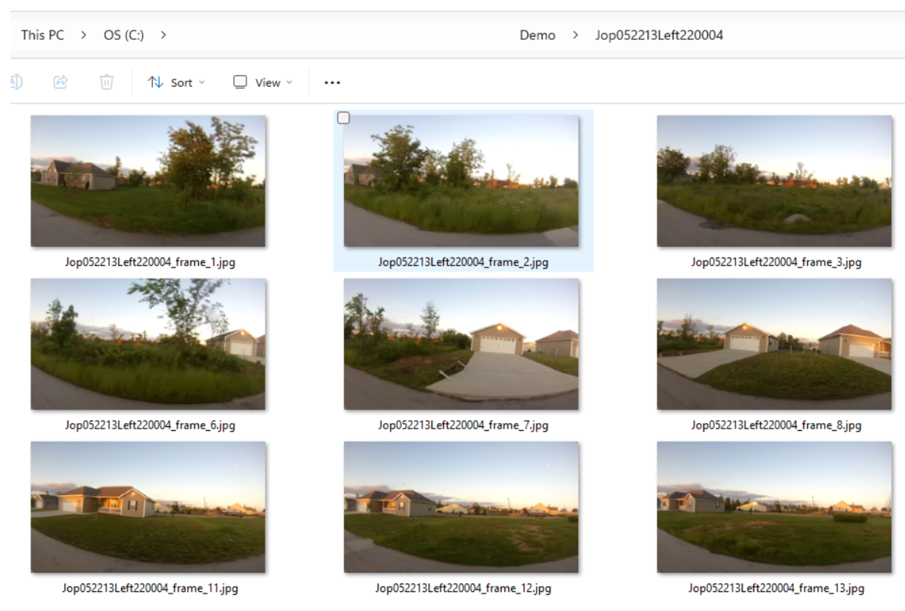

3. Import the `Jasper_County_Parcels.shp` and `Microsoft_Building_Footprint.shp` files clicking on `Add Data` icon.

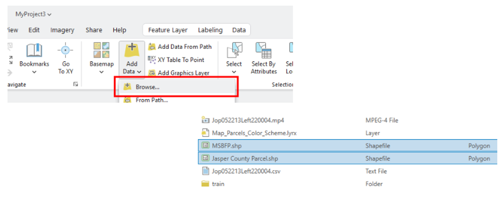

4. Provide inputs to the `Process Spatial Video & GIS` toolbox and click `Run`.

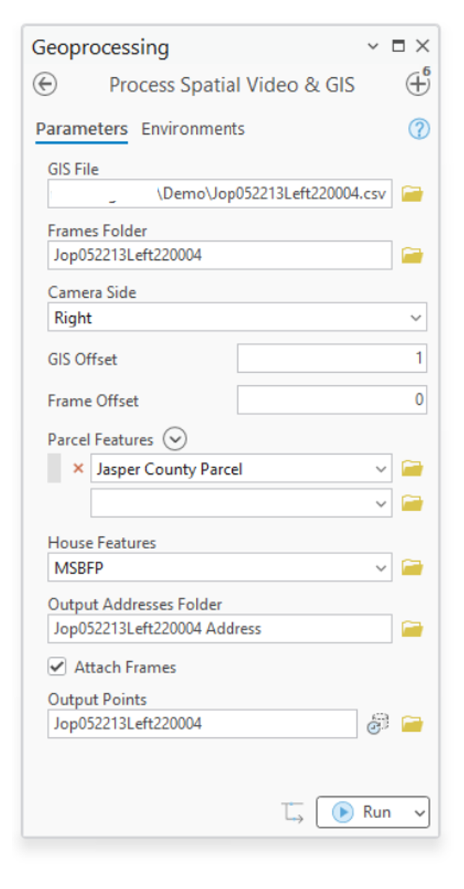

Also, you must ensure that the headings of the parcel feature in the attribute table must be `PIN` and/or `Address` so that the toolbox can correctly locate the addresses.

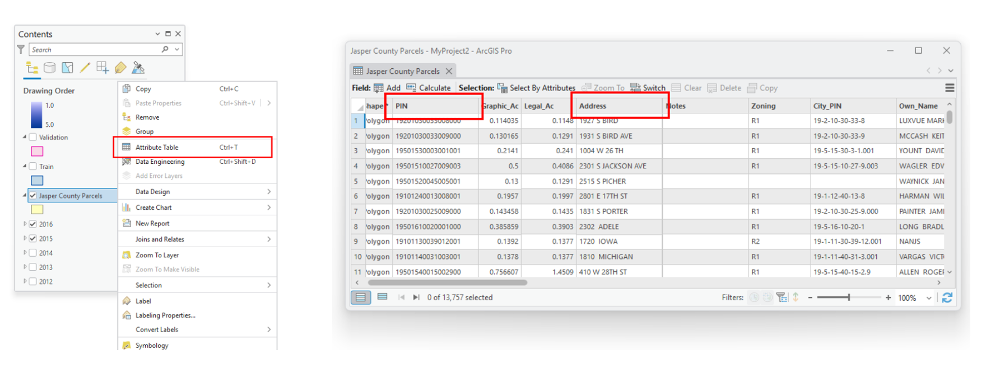

|*Parameters*	|*Elaboration*|
|:---|:---|
|GIS File	| Latitude and longitude coordinates|
|Frames Folder | The folder contains extracted frames from the spatial video|
|Camera Side | The direction the camera was mounted on. It could be either left or right|
|GIS Offset | A correction method to match the GIS and the frame. GIS offset moves the GIS forward|
|Frame Offset | A correction method to match the GIS and the frame. Frame offset moves the frame forward|
|Parcel Features | A feature class that contains polygons of the parcels. This feature acts as a boundary to transform the GIS data|
|House Feature | A feature class that contains polygons of the houses. This feature is used to flag a GIS with an IsSurrounding tag to separate images that contain views of the house from those that do not|
|Attach Frame |	A toggle, when on, attaches a GIS point with a corresponding frame. The frame can be viewed through the pop-up|

5. Confirm that the GIS is transformed correctly and the address folders are sorted properly.
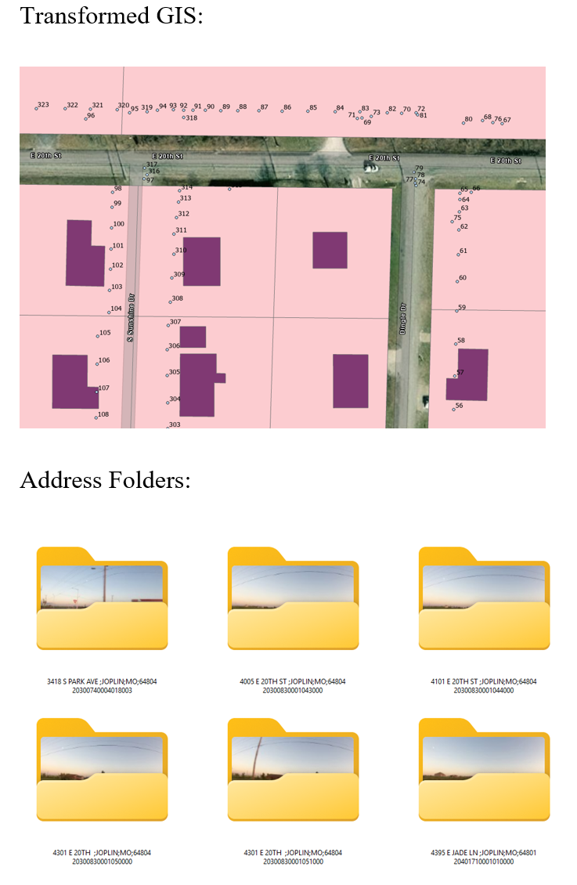


## [Merge Address Folders Toolbox](toolbox/Merge_Address_Folders.pyt)
### Summary
This toolbox merges multiple address folders into one combined Address Folder. This toolbox is particularly helpful when data collections happen over multiple days or comes from different sources. Images from a same address folder will be combined to prevent duplicates. Using this toolbox will alleviate the labeling cost.

### Illustration
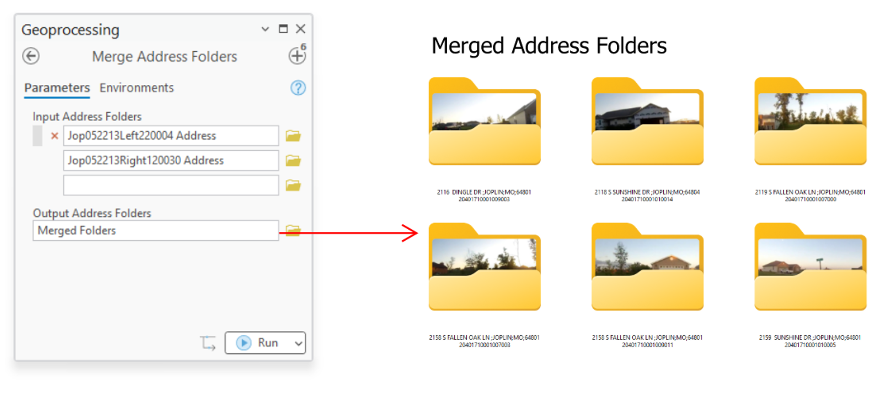

### File Requirements
|*File* |*Elaboration* |
|:---|:---|
|[Jop052213Left220004 Address](<demo/Jop052213Left220004 Address>)|Address folders sorted by the `Process Spatial Video & GIS` toolbox|
|[Jop052213Right120030 Address](<demo/Jop052213Right120030 Address>)|Address folders sorted by the `Process Spatial Video & GIS` toolbox|

### Tutorial
1. Select all folders that need to be merged in `Input Address Folders`.

2. Provide the name of the merged folder in `Output Address Folders` and click `Run`.

## [Map Parcels Toolbox](toolbox/Map_Parcels.pyt)
### Summary
Once the data are labeled, it can be visualized by mapping it in ArcGIS so that the datasets can be split into training, validation, and test sets. Using a Symbology custom layer, the labeled data can be visualized with distinctive color scheme

### Illustration
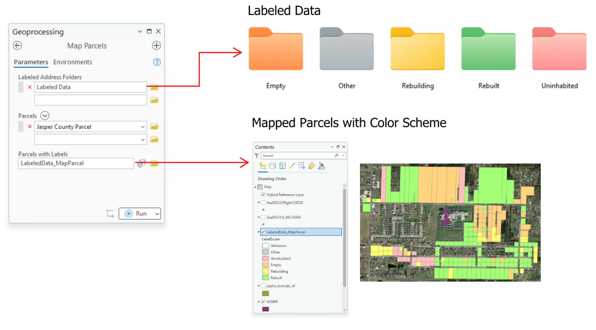

### Files Requirements
|*File* |*Elaboration* |
|:---|:---|
|[Labeled Data](<demo/Labeled Data>)|Folder contains labeled data including *Empty*, *Other*, *Rebuilding*, *Rebuilt*, and *Uninhabited* folders. Each of these folders contains address folders.|
|[Map_Parcels_Color_Scheme.lyrx](<demo/Map_Parcels_Color_Scheme.lyrx>)|Color scheme applied to the parcel polygon feature to visualize the different recovery states.|

### Tutorial
1. Ensure that the folder input under `Labeled Address Folders` follows this structure:

```
Labeled Data/
├─ Uninhabited/
│	├── Address Folder 1/
│	├── Address Folder 2/
│	├── …
├─ Empty/
│	├── Address Folder 10/
│	├── Address Folder 11/
│	├── …
├─ Rebuilding/
│	├── Address Folder 20/
│	├── Address Folder 21/
│	├── …
├─ Rebuilt/
│	├── Address Folder 30/
│	├── Address Folder 31/
│	├── …
└──Other/
	├── Address Folder 40/
	├── Address Folder 41/
	├── …
```

2. Provide `Parcels` input to match the labeled data. This parcel feature must be the same as used previously. Then, click `Run`.

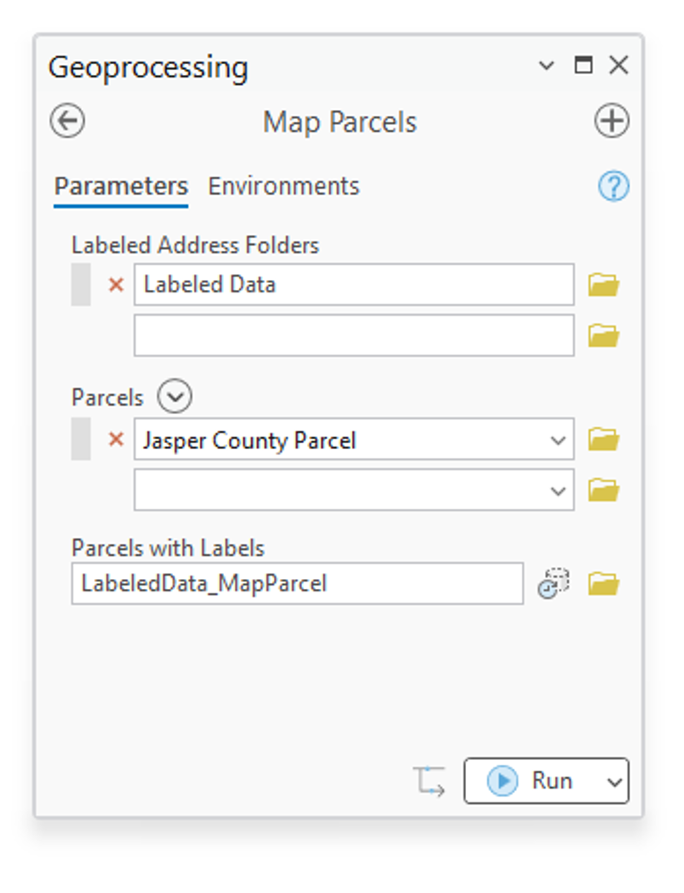
   
3.	To visualize the recovery states:

3.1. Select the output parcel feature.

3.2. In the main ribbon, click on `Feature Layer`.

3.3. In the `Drawing` section, click `Import`.

3.4. Under `Symbology Layer`, click the folder icon.  

3.5. Go to the directory that contains `Map_Parcels_Color_Sheme.lyrx`.

3.6. Click `Apply`.

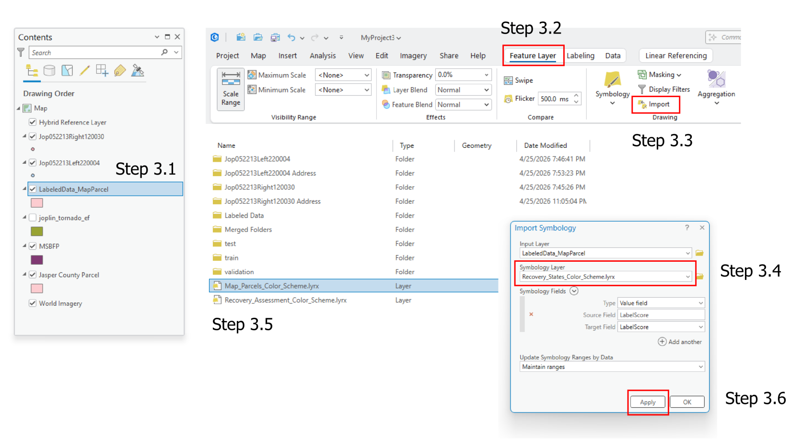

4. View the output:

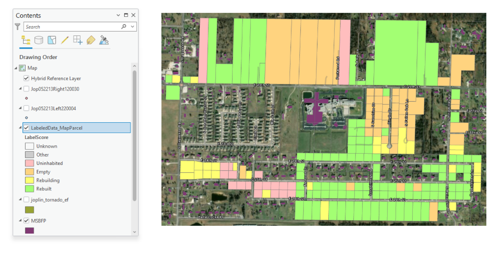


## [Split Datasets Toolbox](toolbox/Split_Datasets.pyt)
### Summary
This toolbox split the input dataset into training, validation, and test sets by drawing the polygons over regions of parcels. The underlying motivation of the toolbox is to provide a clean split of data among the sets for training the deep learning models.

### Illustration


### File Requirements
|*File* |*Elaboration* |
|:---|:---|
|[Labeled Data](<demo/Labeled Data>)| Address folders sorted by the `Process Spatial Video & GIS` toolbox|
|[Jasper_County_Parcel.shp](demo/geospatial_data)| Parcel polygon feature used to transform the GIS data|

### Tutorial
1. Provide a directory to the labeled data under `Labeled Data Folder` and selecte the parcel feature. 

2. Under `Training Region`, `Validation Region`, or `Test Region` input, draw a polygon feature using a pencil tool. After finishing drawing a polygon, click on the checkmarked symbol to finalize the polygon.

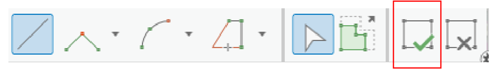
 
3. Provide a directory for `Training Set Folder`, `Validation Set Folder`, or `Test Set Folder`, and click `Run`.

4. Check the notification panel and the output directories to ensure the toolbox properly splits the dataset.

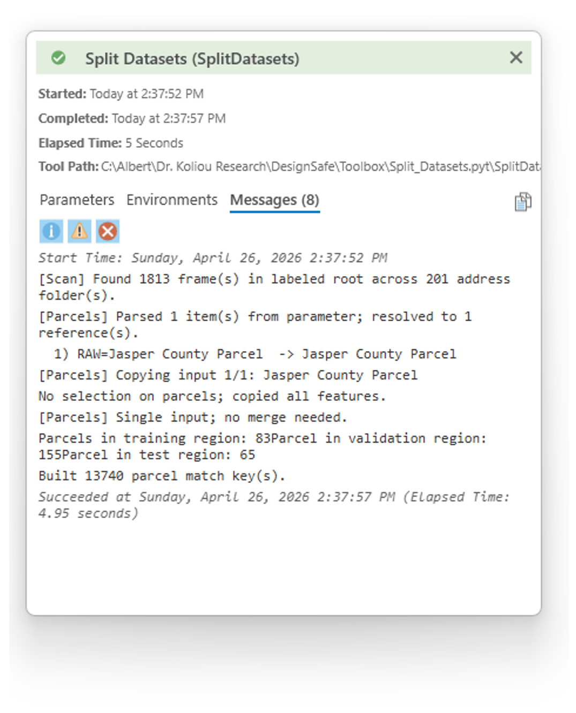


## [Perform Recovery Assessment Toolbox](toolbox/Perform_Recovery_Assessment.pyt)
### Summary
This toolbox performs recovery assessment based on the input `Address Folders`. The parcels will be used to match the addresses from the folders with those of the parcel features. User must provide a pre-trained CNN-LSTM configuration file (.pth file). A default `Confidence Threshold` of 0.5 will be set to filter out low-confident results. `Attach frames to parcels` can be toggled on to visualize the frames corresponding to each parcel. The output of this toolbox is a parcel feature containing predicted recovery states and prediction confidence. The results can also be visualized using a custom `Symbology`.

### Illustration
 
### Files Requirements
|*File* |*Elaboration* |
|:---|:---|
|[cnn-lstm_epoch_017.pth](checkpoint/cnn-lstm_epoch_017.pth) | PyTorch file containing pre-trained weights of the CNN-LSTM model |
|[Jop052213Left220004 Address](<demo/Jop052213Left220004 Address>) | Address folders sorted by the `Process Spatial Video & GIS` toolbox |
|[Jop052213Right120030 Address](<demo/Jop052213Right120030 Address>) |	Address folders sorted by the `Process Spatial Video & GIS` toolbox |
|[Recovery_Assessment_Color_Scheme.lyrx](demo/Recovery_Assessment_Color_Scheme.lyrx) | Color scheme applied to the parcel polygon feature to visualize the recovery states |

### Tutorial
1. Provide input directories under `Address Folders` and the `Parcels` to match the addresses.

2. Load the `cnn-lstm_epoch_017.pth` to the toolbox.

3. (Optional) set a `Confidence Threshold` to filter out predictions with low confidence; otherwise a default value of 0.5 will be used.

4. (Optional) toggle on `Attach frames to parcels` to view the street-view imagery corresponding to the parcels. The frames can be view under pop-up.

5. Rename the output parcels as necessary and click `Run`.

6.  To visualize the results:

	6.1. Select the output parcel feature.

	6.2. In the main ribbon, click on `Feature Layer`.

	6.3. In the `Drawing` section, click `Import`.

	6.4. Under `Symbology` Layer, click the folder icon.
	
	6.5. Go to the directory that contains `Recovery_Assessment_Color_Sheme.lyrx`.

	6.6. Click `Apply`.

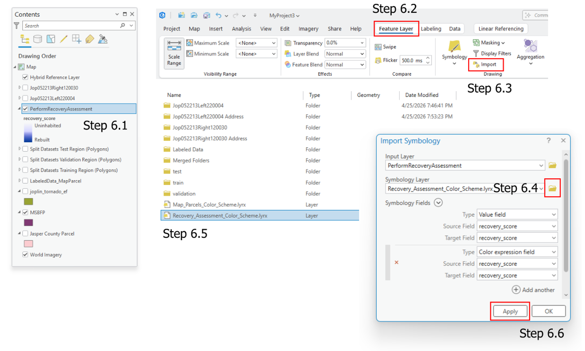

7. View `Attribute Table` of the output parcel feature.

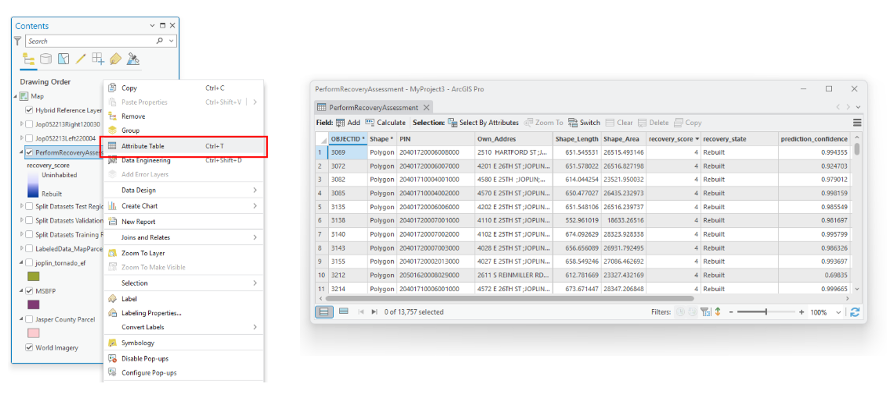

  
## [Perform Longitudinal Analysis Toolbox](toolbox/Perform_Longitudinal_Analysis.pyt)
### Summary
This toolbox performs a longitudinal analysis based on the input recovery assessment feature classes. The longitudinal analysis will only be performed on parcels that have a full record of recovery states. The Output Longitudinal Results Files write out two CSV files. The first file calculates the percentage of recovered buildings (i.e., buildings reached *Rebuilt* status) at each year. The second file calculates the recovery time of each building; in other words, it determines how long it takes for a building to reach *Rebuilt* status. The toolbox also output a parcel feature class to visualize the recovery time.

### Illustration

 
### Files Requirements
|*File* |*Elaboration* |
|:---|:---|
|[longitudinal results](demo/longitudinal_results) | Recovery assessment features obtained from using the `Perform Recovery Assessment` toolbox |
|[Longitudinal_Results_Color_Scheme.lyrx](demo/Longitudinal_Results_Color_Scheme.lyrx) | Color scheme applied to the parcel polygon feature to visualize the recovery time |

### Tutorial
1. Input the name of the feature class under the `Year` column and the recovery assessment feature class under `Housing Recovery Feature Class` column.

2. Select a directory to output the CSV files. The toolbox will output `percent_recovered.csv` and `years_to_recover.csv` files.

3. Rename the output parcel feature as necessary and click `Run`.

4. To visualize the results:
   
	4.1. Select the output parcel feature.

	4.2. In the main ribbon, click on `Feature Layer`.

	4.3. In the `Drawing` section, click `Import`.

	4.4. Under `Symbology` Layer, click the folder icon.

	4.5. Go to the directory that contains `Longitudinal_Results_Color_Scheme.lyrx`.

	4.6.  Click `Apply`.

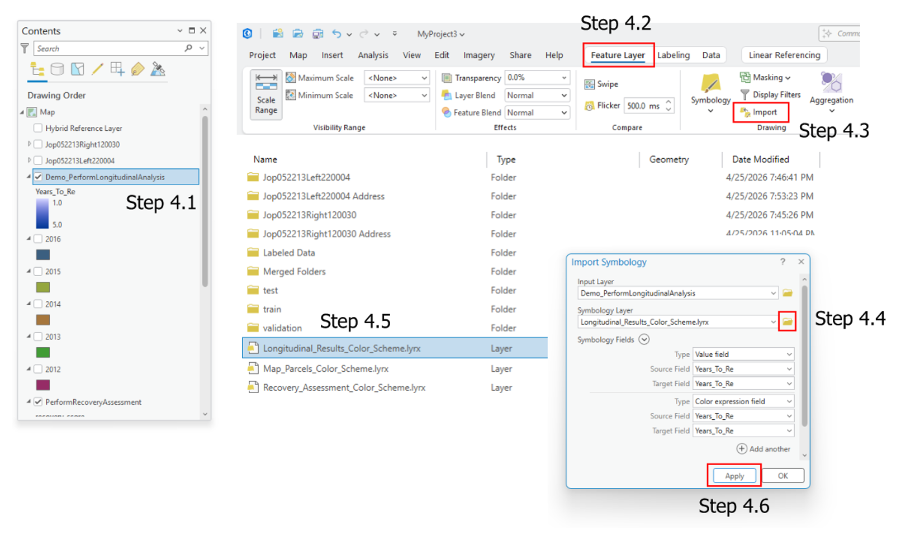
 
5. View the `Attribute Table` and the CSV files.

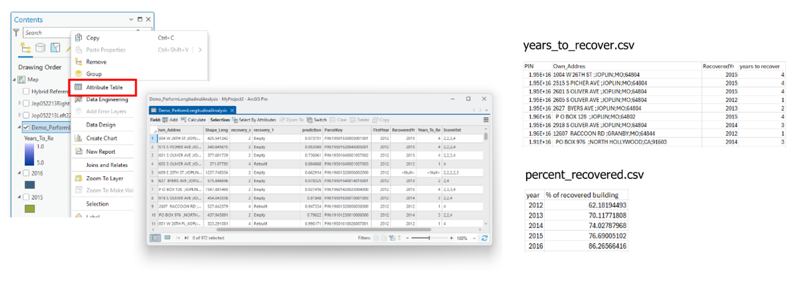

